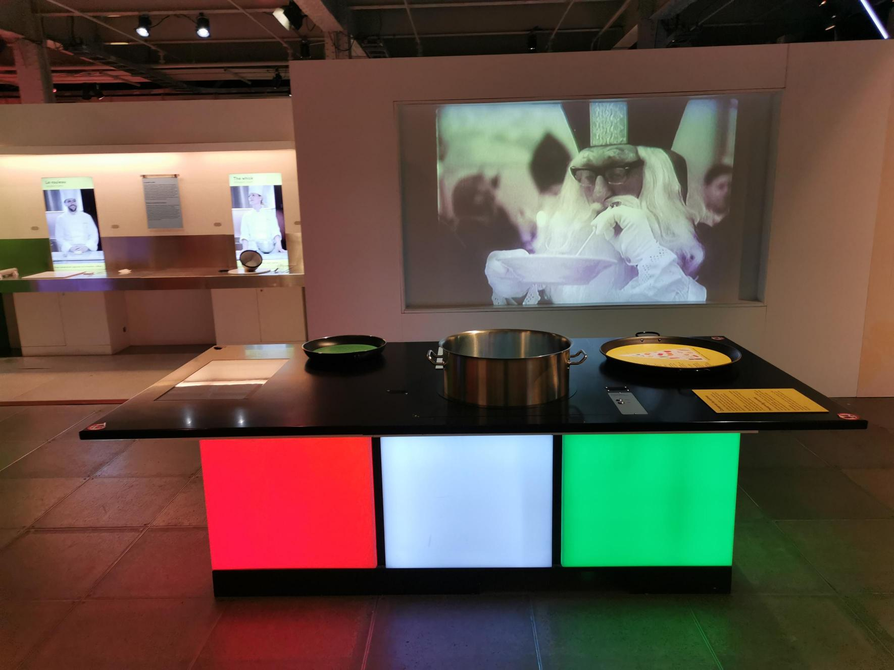
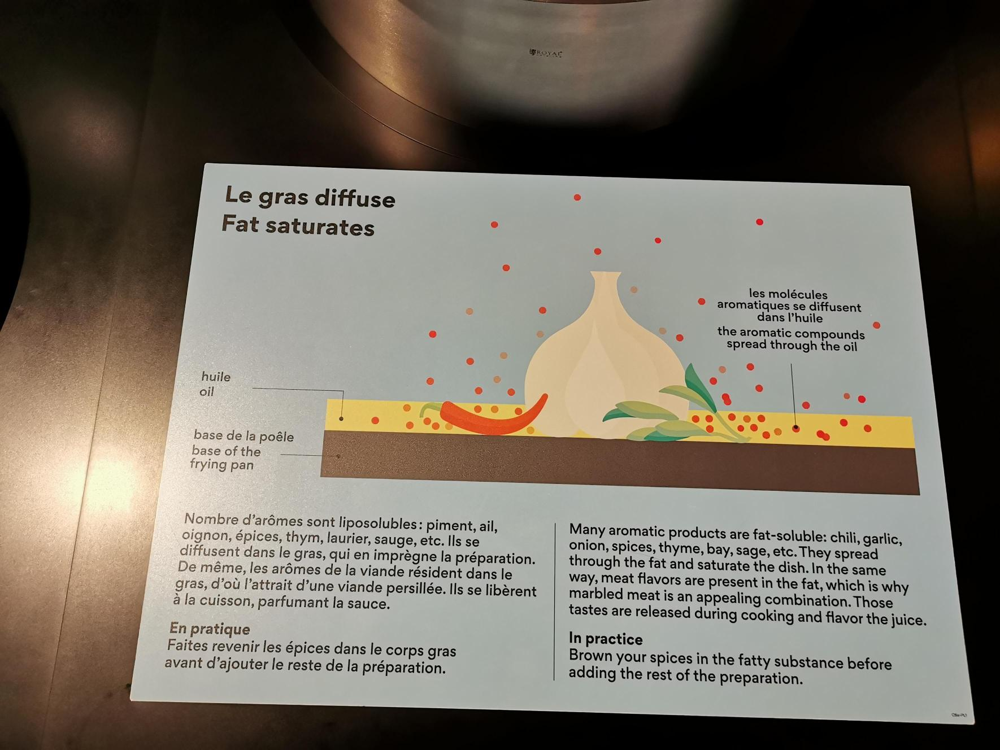
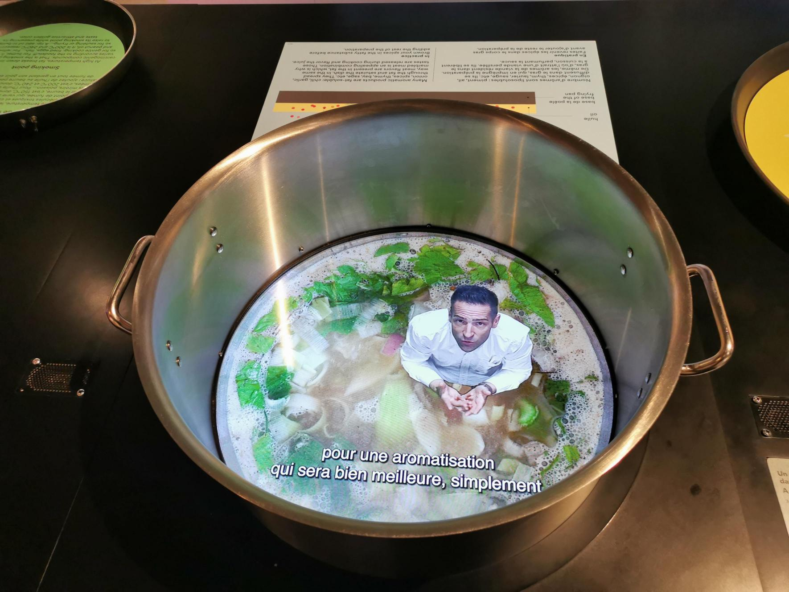
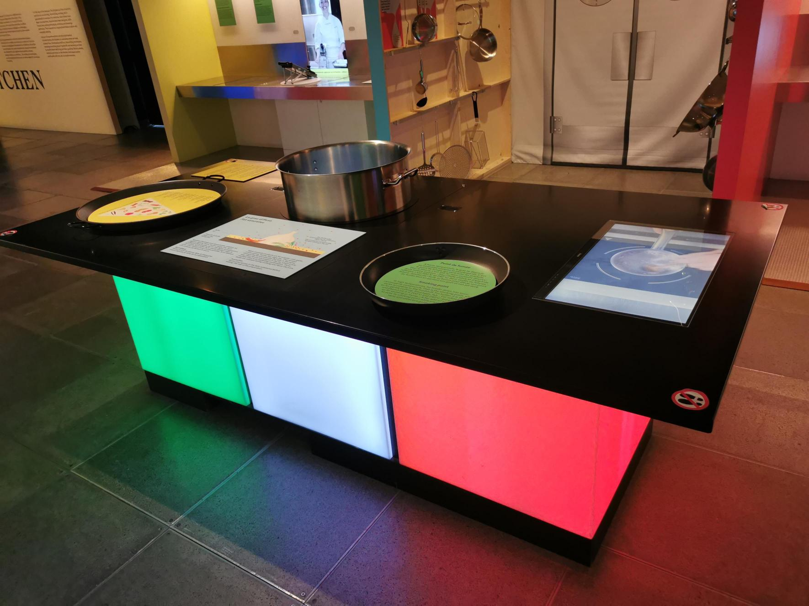
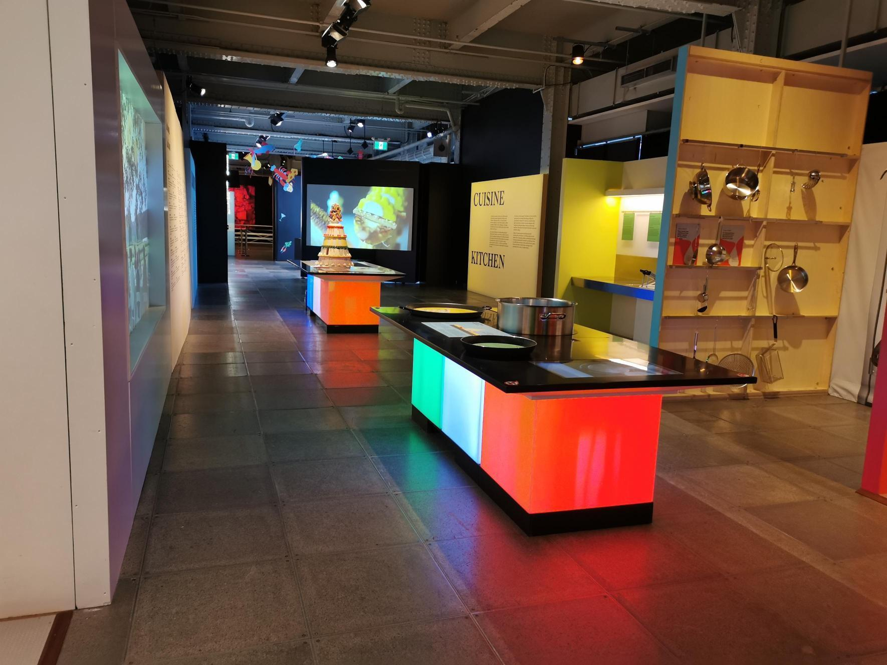

 # Bienvenue chez le Centre des Sciences
 # Lieu de mise en exposition
 Bonjour, aujourd'hui je vais vous parlez d'un projet dont j'ai pu visiter Jeudi le 30 Janvier 2025. Une exposition interactive qui a lieu à Montréal au Vieux Port de Montréal. Une exposition qui a pour but 
 de montrer aux spectateurs curieux de quoi parle cette exposition. Je suis sure que vous allez aimez ce blogue. Aussi, voici une photo de moi devant l'entrée de l'édifice. 
 
# Nom de l'exposition ou de l'événement
 c'est exact, il s'agit du Banquet. Une exposition qui nous décrit une expérience culinaire toute en gardant un petit aspect scientifique. En plus, elle permet d'ouvrir pour certains la porte vers l'univers de la cuisine. pour certains, vous allez dire que presque tout le monde sait cuisiner, mais je peux vous le garantir que c'est pas tout le monde qui est capable. Bref, c'est une experience enrichissante à ne pas manquer. Dans cette découverte, j'ai pu voir plusieurs projets facisnant qui font parties du multimédia et je suis content de vous partagez
 celui que j'ai pris. 

# Un chimiste dans un bouillon
Voici à quoi ressemble le projet dans sa globalité. Un chimiste dans un bouillon est un type d'exposition intérieure qui propose aux personnes curieuses
comment fonctionne le mélange d'aliments et comment elles se mélangent entres eux. Le problème étant qu'il est temporaire. Alors Dépechez vous à y aller.   

# Nom de la firme 
 Dans cette image, nous pouvons constatez comment fonctionne les aliments lorsqu'ils sont bouillis dans une soupe. De plus, le language utilisé facilite la compréhension du texte. Utiliser des images et montrer les différentes choses qui arrivent pendant la cuisson est parfaitement mise en place. L'anné de production à été fait en 2024 d'où la clairvoyance dans les mots ou dessin. 

# Description de l'oeuvre
 Sur la table du chimiste dans le bouillon, il possède deux poèles, 3 affiches et un écran qui nous permets de voir comment fonctionne fonctionne de plus près les mélanges d'ingrédients pour faire un bon repas. Le type d'installation est immersive parce que comme on peut constater nous sommes à l'interieur de la caserrole. À
partir de là, le cuisiner nous montres comment tout fonctionne. À des momments, il va gouter comme s'il etait vraiment dans la cuisson. Enfin, les poeles nous permets d'en connaitre plus sur les compatibilités que offres les aliments mises ensembles. Encore une fois, les mots choisis, les images choisis et les couleurs choisis sont très faciles à comprendre pour des jeunes enfants ou adolescents, car ces couleurs vives permettent d'attirer et cela est vraiment intéressant. 

Voici une autre vue d'un autre angle qui permet de voir les autres choses sur la table.

# Mise en espace
Alors, l'espace reservé est vraiment voyant. Lorsque quelqu'un rentre dans le Banquet, il voit un projet, mais juste après il voit le chimiste dans un bouillon. 
Le choix d'avoir mit le projet ici dès le début est un geste incroyable parce que cela encourage les jeunes à voir comment la cuisine fonctionne et ouvre la porte de la cuisine aux jeunes. 

 # Composantes et techniques et Élements nécessaires à la mise en exposition
 Bon sur ce point ils n'y a pas beaucoup d'éléments relever à la technique multimédia. Cependant, le projet avait un projet dans la table, ce qui, amenait à voir dans la casserole. Ensuite, deux bouttons qui avaient pour but d'activer le lancement de la vidéo en 2 langues. Après, en dessous de la table, avait 3 gros blocs qui projettaient de la lumières. Les trois possèdes des cables qu'on ne peut pas voir qui illumine les 3 bloques. La table avait aussi un dispositif qui permet de voir un écran depuis la table. il avait des projetteurs dans le plafond, mais il y en partout dans l'exposition, donc je le compte pas vraiment dans le projet.
  

 # Expérience vécue et ce qui ma plus
 Ce qui ma plu dans le projet ces la facilité d'en apprendre plus sur la cuisine. en effet, elle permet aux jeunes d'avoir une excellent alimentation saine qui leur permettra de bien se nourrir et d'etre en santé. Les jeunes auront une autonomie à créer des plats incroyables sans à avoir des doutes sur quoi va avec quoi. Ceci permettra d'etre créatif avec ce qui son dans les mains. La motivation de devenir meilleur dans ce domaine. Pour finir, elle permet de réduire le gaspillage dans la nourriture malsain comme Mcdonald, Burgerking, Subways, etc. En réduisant ils deviennent plus responsable. 
 Voici une vidéo explicative du projet de quelques secondes. https://youtube.com/shorts/JxPd5VVvcy4?feature=share

 Merci beaucoup. 
