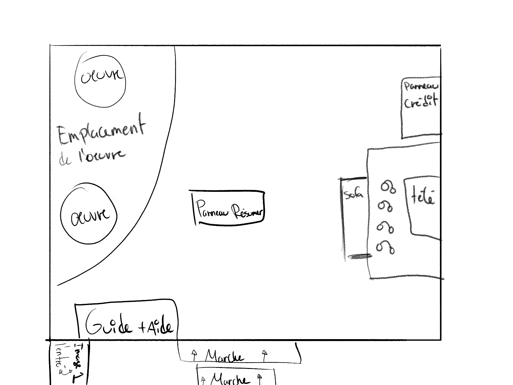
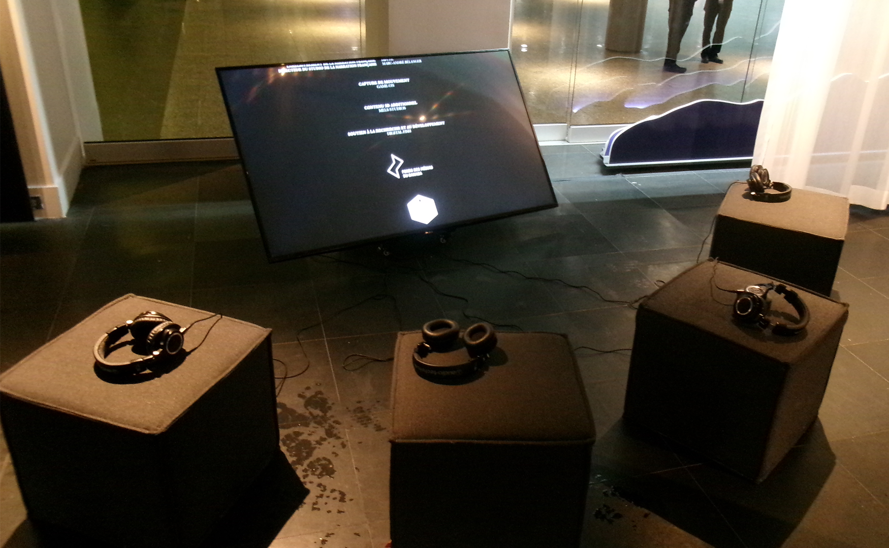
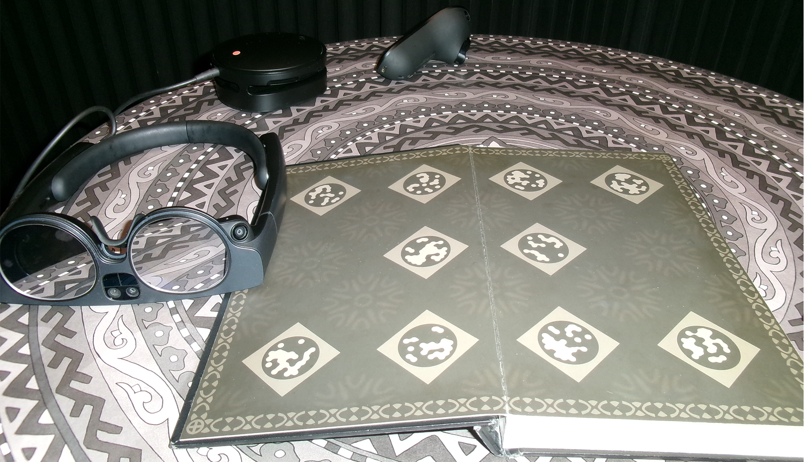
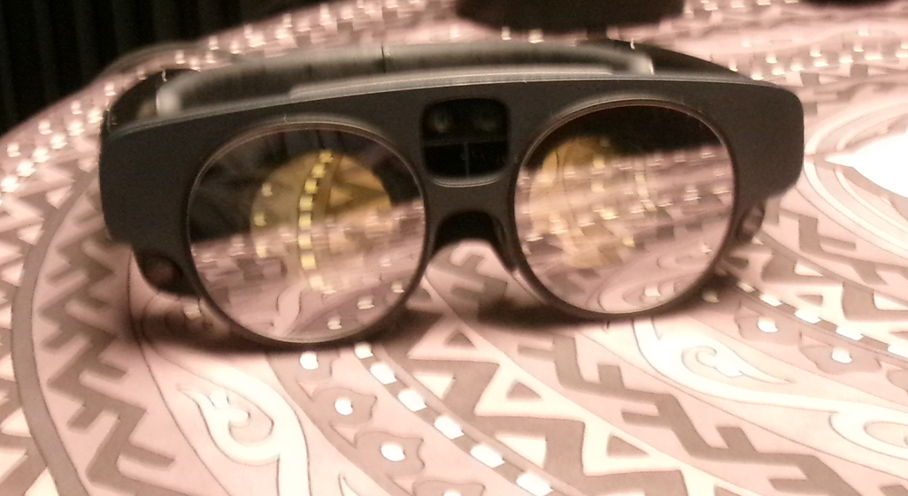

#  Exposition :  Jim Henson’s The Storyteller: Les sept corbeaux 

Photo prise par Olivier Leconte

## Début + Resumer de L'histoire et date de création

Bonjour, je vais vous parler de l'exposition Jim Henson’s The Storyteller: Les sept corbeaux. J'ai eu le
plaisir de visiter l’œuvre le 20 février 2025 à la Place des Arts en fin de journée au centre ville pour
le cours œuvre et dispositif multimédia.
C’est l’histoire d’une fille qui a vu le jour dans une famille de fermiers de sept garçons. Le père va leur demander de ramener de l’eau, mais ils vont échapper le seau dans un puit et par peur ils vont s’enfuir 
sans aucune trace. Alors, plus vieille elle va aller les chercher. L'exposition a été créé par Felix & Paul Studios et présentée en 2023 lors d’une compétition officielle dans le cadre du programme Venice Immersive du Festival international du film de Venise 2023.
#
Le resumer de l'histoire en détail. 

Photo prise par Olivier Leconte

##  Éléments nécessaires à la mise en exposition

Ils ont mis une grande image devant l’entrée permettant de voir à quoi ressemble l’exposition. Ensuite, il y avait une grande télévision avec des casques qui expliquait la production et le développement de l’œuvre.
Après, pendant la mise en exposition, il y a une petite table qui tenait tout l’équipement. Ensuite, un rideau qui bloquait la lumière pour avoir une sensation correcte. Pour finir, il avait une affiche qui montrait 
les remerciements envers le personnel ainsi que toutes les personnes qui avaient travaillé dessus. Avant, voici un dessin fait par Olivier Leconte pour vous illustrer à quoi ressemble l'endroit.

Dessin fait par Olivier Leconte
#
Voici une photo à quoi ressemblait l'emplacement où il y avait une télévision.

Photo prise par Kevin Calixte et prise sur le site officiel Place des Arts: https://www.placedesarts.com/evenement/storyteller-les-sept-corbeaux

#
Une photo de plus près de la télévision avec personne à l'horizon.

Photo prise par Olivier Leconte
#
Là ce trouve le casque de réalité augmentée, la manette, la relieur de cable et le livre.

Photo prise par Olivier Leconte

## Composants

Maintenant, allons plus en profondeur concernant les composants. Dans l’image que vous vous apreter à voir, vous pourriez voir les éléments qui permettent de faire fonctionner l'exposition.

Photo prise par Olivier Leconte

### Le casque
Premièrement, nous avons le casque. Il permet de voir la réalité augmentée et d'interagir. L'utilisateur,lui, peut voir en temps réel ce qui ce passe entre le jeu et le monde réel.
 Dans le casque possède des capteurs de mouvement et ceux-ci capturent les mouvements de la tête et ajustent l'affichage pour correspondre à votre point de vue.Juste à coté de l'oreille, possède un mini haut-parleur qui permet d'entendre le son.
 #

Photo prise sur le site ucmfinal.store : https://www.ucmfinal.store/?path=page/ggitem&ggpid=500095
# 
La photo du casque de réalité augmentée.

Photo prise par Olivier Leconte

