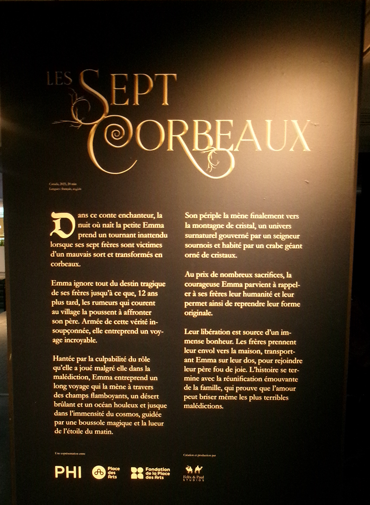
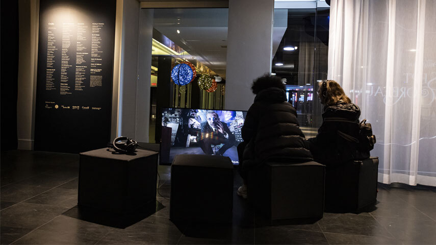

#  Exposition :  Jim Henson’s The Storyteller: Les sept corbeaux 

Photo prise par Olivier Leconte

## Début + Date 

Bonjour, je vais vous parler de l'exposition Jim Henson’s The Storyteller: Les sept corbeaux. J'ai eu le
plaisir de visiter l’œuvre le 20 février 2025 à la Place des Arts en fin de journée au centre ville pour
le cours œuvre et dispositif multimédia.

##  Resumer de L'histoire et date de création

C’est l’histoire d’une fille qui a vu le jour dans une famille de fermiers de sept garçons. Le père va leur demander de ramener de l’eau, mais ils vont échapper le seau dans un puit et par peur ils vont s’enfuir 
sans aucune trace. Alors, plus vieille elle va aller les chercher. L'exposition a été créé par Felix & Paul Studios et présentée en 2023 lors d’une compétition officielle dans le cadre du programme Venice Immersive du Festival international du film de Venise 2023.
#
Le resumer de l'histoire en détail. 

Photo prise par Olivier Leconte

##  Éléments nécessaires à la mise en exposition

Ils ont mis une grande image devant l’entrée permettant de voir à quoi ressemble l’exposition. Ensuite, il y avait une grande télévision avec des casques qui expliquait la production et le développement de l’œuvre.
Après, pendant la mise en exposition, il y a une petite table qui tenait tout l’équipement. Ensuite, un rideau qui bloquait la lumière pour avoir une sensation correcte. Pour finir, il avait une affiche qui montrait 
les remerciements envers le personnel ainsi que toutes les personnes qui avaient travaillé dessus.
#
Voici une photo à quoi ressemblait l'emplacement où il y avait une télévision.

Photo prise par Kevin Calixte et prise sur le site officiel Place des Arts: https://www.placedesarts.com/evenement/storyteller-les-sept-corbeaux
#
Une photo de plus près de la télévision avec personne à l'horizon.

Photo prise par Olivier Leconte
