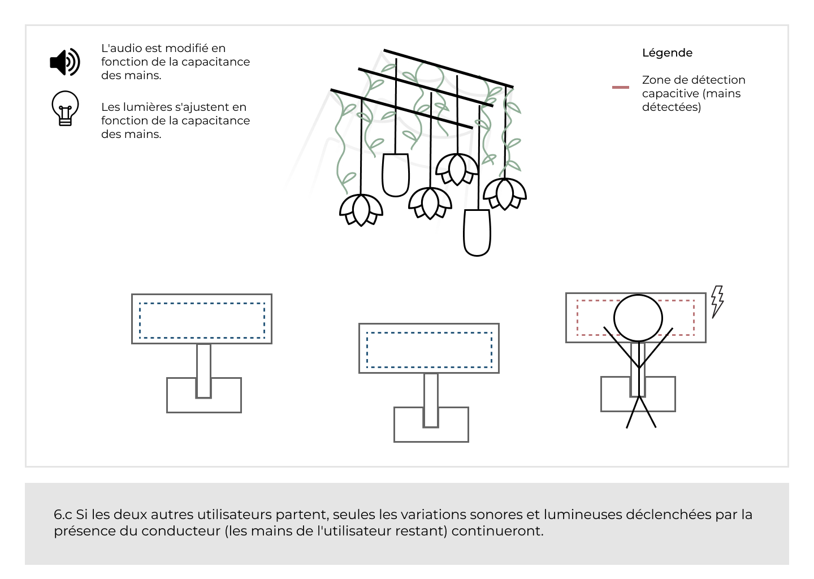
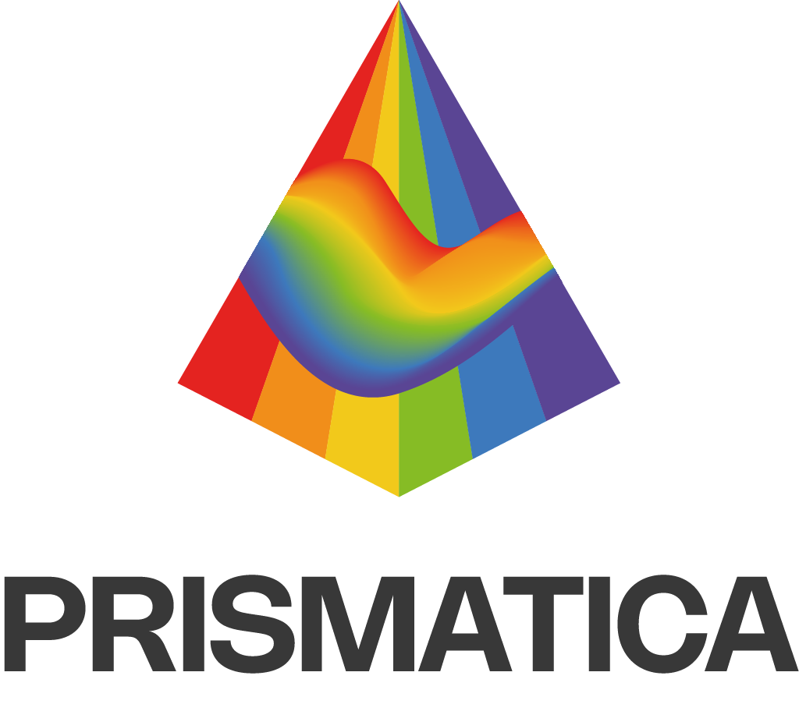

f# TP02 Exposition des étudiants finissants en TIM
Bonjour, je vais vous parlez de l'exposition Résonnance. Il s'agit de plusieurs oeuvres finissants en Tim. Ils y avaient beaucoup d'oeuvres intéressantes avec des idées extraodinaires, mais il y en a un qui c'est demarqué le plus des autres à mon avis.
En effet, l'oeuvre ce base sur la chromesthésie une forme de synesthésie permettant avec des équipements d'entendre les couleurs dessinées sur un tableau. En espérant que cela va vous plaires, mais avant, voici un 
ordre de 1 à 10 selon les projets préférés.

# Ordre de préférence des projets.

1 - Prismatica
 
   Ikrame Rata : Chef de projet.
   Vincent Delisle : Développeur et concepteur sonore. 
   Jérémy Duverseau : Directeur artistique.
   
   Voici le plan qui résume où se trouve l'oeuvre
   

   Plantation au studio image représentative 1
   Resource trouvée et partagée par Prismatica :  https://pootpookies.github.io/Prismatica/#/30_production/60_plantation/ 
  
#

2 - Luminatura

   Prethiah Rajaratnam : Programmeuse et administratrice du projet.
   
   Audrey Dandurand : Directrice Audio Visuel et Gestionnaire de projet.
   
   Justine Rousseau : Programmeuse Coordinatrice des medias.
   Camilia Bouatmani : Directrice Artistique. 
   Ihab Mouhajer : Développeur intéractif.
   
   
     Resource trouvée et partagée par Luminatura : https://miaou-mafia.github.io/projet-luminatura/#/20_intention/40_scenarimage/
 
#
3 - Arcadia

   Dominic Yale : Conception sonore.
   William Beauvais : Conception visuelle.
   Anton Nikulin : Programmation.
   
#
4 - C0N DU8

   Ian Corbin : Designer de niveaux
   Samuel Desmeules-Voyer : Directeur artistique.
   Alexandre Gervais : Programmeur des méchansimes.
   Keven Malric : Responsable du développement technique.
   Jérémy Roy-Coté : Programmeur Interconnectivité.
   
   
   #
     
5 - ETHERIA

    Joshua Gonzalez-Barrera : Monteur Vidéo, Artiste Design, Programmeur.
    Victor Gileau : Programmeur, Artiste Design.
    Michael Un Dupré : Programmeur, Artiste VFX/Design.
    Pierre-Luc Proulx : Progammeur, Artiste VFX/Design, Artiste 3D.
    Maik_Hamel : Compositeur Sonore, programmeur.
    

#
6 - FUGA

    Yavuz-Selim Gucluer : Progammeur.
    Daniel Dezemma : Directeur Visuel.
    Tristan Khadka : Directeur sonore.
    Abdel Ali Djeral : Programmeur.
#
7- Internarture 

    Sitmonternna Yi : Responsable de la gestion et suppervision des ressources techniques, mapping vidéo, conception sonore.
    Delphine Grenier : Gestion et l'organisation du projet, Programmation de l'interactivité, visuelle.
    Isaac Fafard : Intégrateur multimédia. Responsable de la communication entre le numérique et le réel. Programmeur.
    Kenza El Harrif : Direction artistique, conception sonore.
    Khaly Tia Sing : Chargée de l'équipe, l'organisation du projet, qualité des projets, programmation des lumières

Voici l'ordre dans laquelle j'ai aimé voir les projets. Bref, sans plus vous faire attendre voici le projet que j'ai le plus aimé.
# PRISMATICA
 En  effet, Prismatica est un projet qui se base sur la chromesthésie. Ils se basse sur  Le groupe d'étudiant au nom d'Ikrame Rata, Vincent Delisle et Jérémy Duverseau qui ont pour but d'afficher du son
 grâce à des couleurs dessinées sur un tableau blanc. 

 

 #
