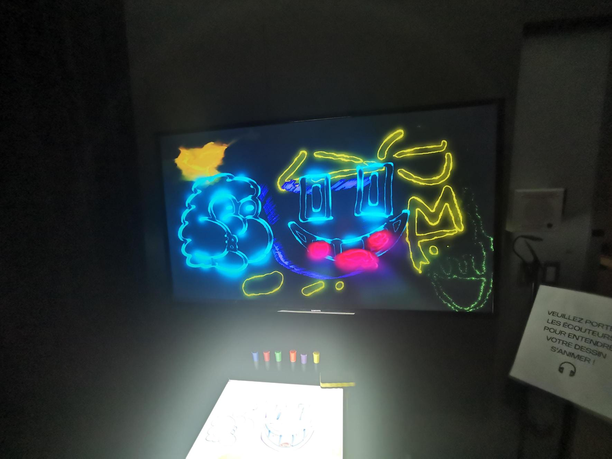
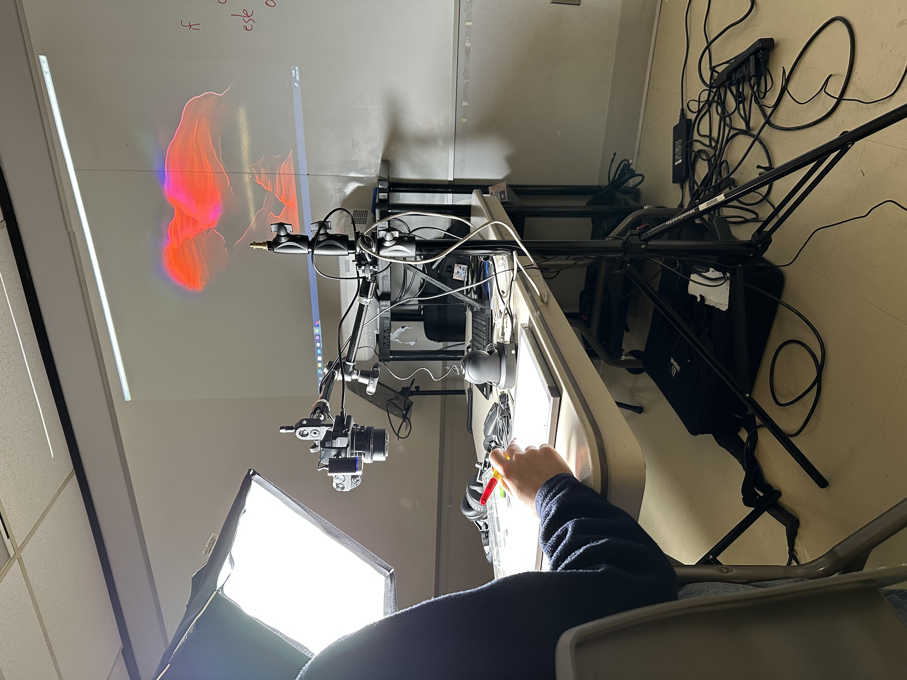
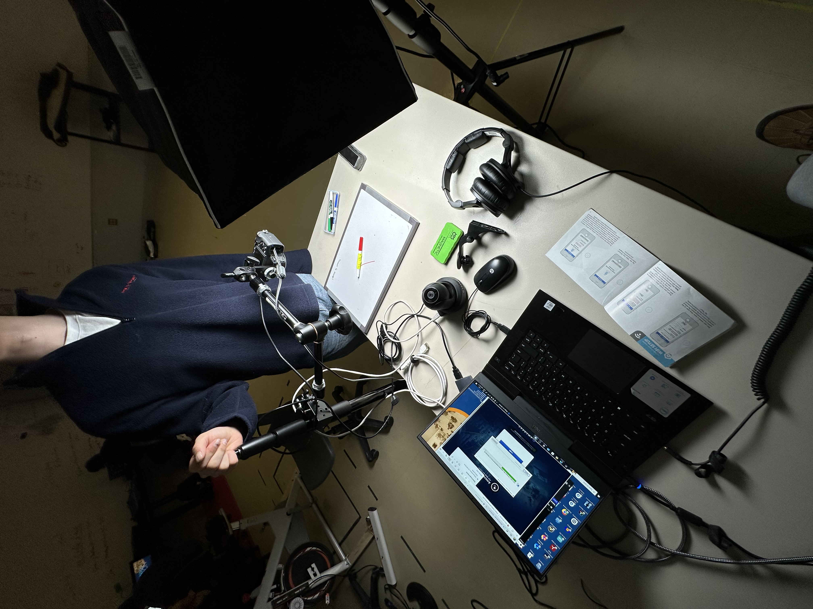

 # TP02 Exposition des étudiants finissants en TIM
 
 Photo prise par Olivier Leconte
 #
Bonjour, je vais vous parlez de l'exposition Résonnance. Ma première visite a été le 20 février 2025  et la deuxième fois le 18 Mars 2025 au collège Montmorency. Il s'agit de plusieurs oeuvres finissantes en Tim. Ils y avaient beaucoup d'oeuvres intéressantes avec des idées extraodinaires, mais il y en a un qui c'est demarqué le plus des autres à mon avis.
En effet, l'oeuvre se base sur la chromesthésie une forme de synesthésie permettant avec des équipements d'entendre les couleurs dessinées sur un tableau. En espérant que cela va vous plaires.

 # PRISMATICA
 En  effet, Prismatica est un projet qui ce base sur la chromesthésie. Le groupe d'étudiant au nom d'Ikrame Rata, Vincent Delisle et Jérémy Duverseau qui ont pour but d'afficher du son
 grâce à des couleurs dessinées sur un tableau blanc. Un budget de 500$ a été utilisé pour faire ce magnifique projet.  

 ##  Équipe
    Ikrame Rata : Chef de projet.
    Vincent Delisle : Développeur et concepteur sonore. 
    Jérémy Duverseau : Directeur artistique.

 ## En action 
 
Photo Prise par Olivier Leconte
 #
L'espace  vu d'un autre angle.
 
 photo Prise par Olivier Leconte
 #

 ## Les Matériaux utilisés

 ### Caméra
 La caméra a été donné par l'école.
 
Resource trouvée et partagée par Prismatica sur leur site : https://pootpookies.github.io/Prismatica/#/40_maquette/
 #
 ### Processeurs et Ordinateurs
L'ordinateur été donné par l'école.

Resource trouvée et partagée par Prismatica sur leur site : https://pootpookies.github.io/Prismatica/#/40_maquette/

 ### Diffusion et affichage
Le projecteur été donné par l'école.

Resource trouvée et partagée par Prismatica sur leur site : https://pootpookies.github.io/Prismatica/#/40_maquette/

## Mon appréciation
 J'ai tellement aimé le fait de recréer un son grâce à un dessin. Je suis quelqu'un qui dessine pendant son passe-temps et voir ce truc me donne seulement un grand sourire.
 Aussi, l'idée est originale et magnifique parce que tous les autres projets se ressemblent beaucoup. Ils ont presque tout pour but la nature alors que lui c'est la couleur et le son. 
 Cependant, l'execution n'est pas très agréable. Le manque d'information sur le site et en place est un peu confusant. Malheureusement, je mettrais une note de 7/10 juste parce que l'originalité est vraiment présente.

 

 
  

 

 
