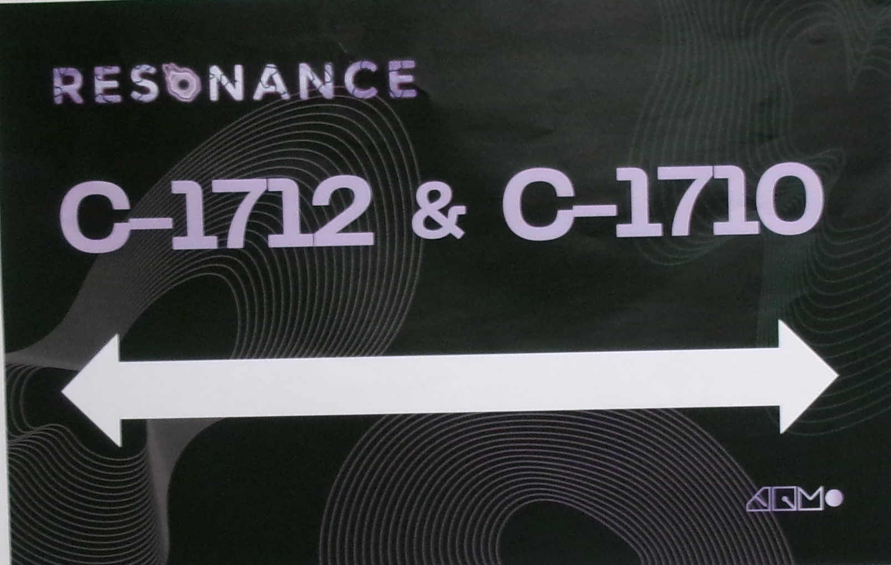

 # TP02 Exposition des étudiants finissants en TIM
 
 #
Bonjour, je vais vous parlez de l'exposition Résonnance. J'ai été visité le 18 Mars 2025 au collège Montmorency. Il s'agit de plusieurs oeuvres finissantes en Tim. Ils y avaient beaucoup d'oeuvres intéressantes avec des idées extraodinaires, mais il y en a un qui c'est demarqué le plus des autres à mon avis.
En effet, l'oeuvre se base sur la chromesthésie une forme de synesthésie permettant avec des équipements d'entendre les couleurs dessinées sur un tableau. En espérant que cela va vous plaires.

 # PRISMATICA
 En  effet, Prismatica est un projet qui ce base sur la chromesthésie. Ils se basse sur  Le groupe d'étudiant au nom d'Ikrame Rata, Vincent Delisle et Jérémy Duverseau qui ont pour but d'afficher du son
 grâce à des couleurs dessinées sur un tableau blanc. 

 ##  Équipe
    Ikrame Rata : Chef de projet.
    Vincent Delisle : Développeur et concepteur sonore. 
    Jérémy Duverseau : Directeur artistique.

 

 
