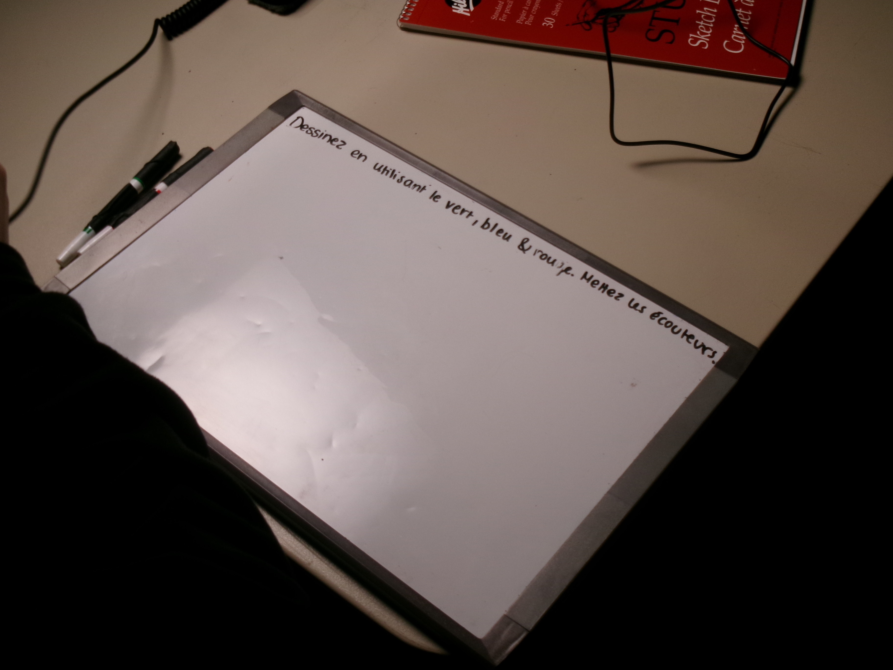
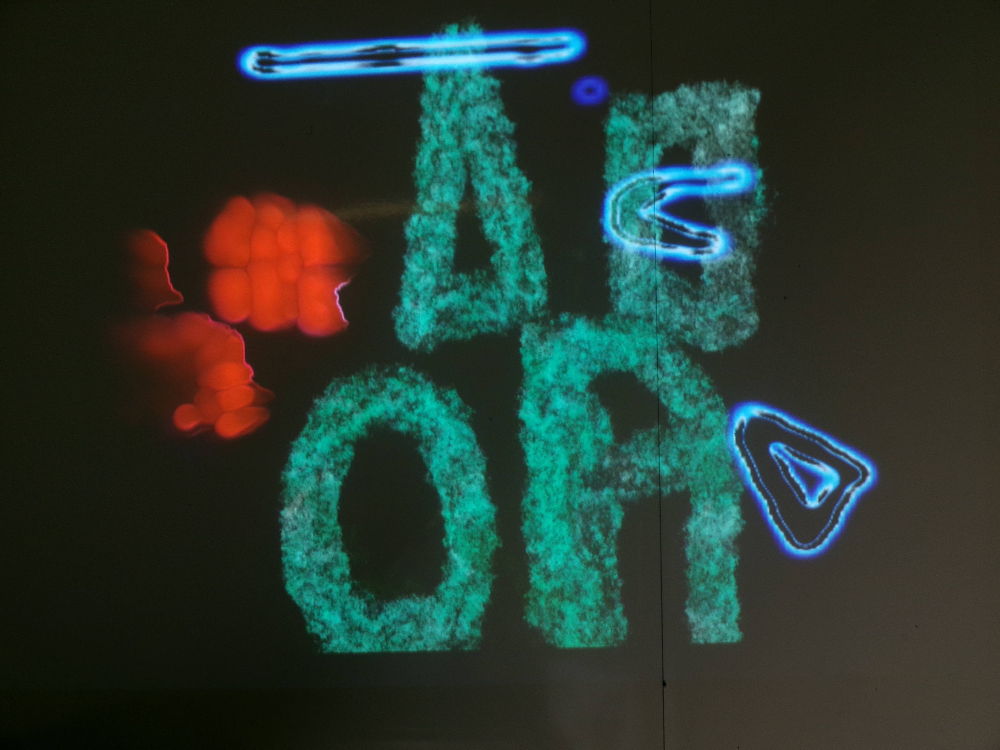
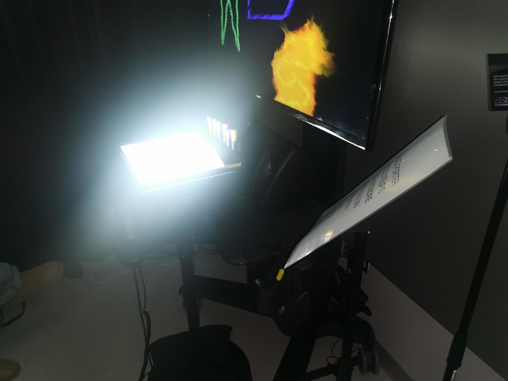

 # TP02 Exposition des étudiants finissants en TIM
Bonjour, je vais vous parlez de l'exposition Résonnance. Il s'agit de plusieurs oeuvres finissants en Tim. Ils y avaient beaucoup d'oeuvres intéressantes avec des idées extraodinaires, mais il y en a un qui c'est demarqué le plus des autres à mon avis.
En effet, l'oeuvre ce base sur la chromesthésie une forme de synesthésie permettant avec des équipements d'entendre les couleurs dessinées sur un tableau. En espérant que cela va vous plaires, mais avant, voici un 
ordre de 1 à 10 selon mes projets préférés.

# Ordre de préférence des projets.

## Prismatica
Bon pour commencer, l'oeuvre ce base sur la chromesthésie une forme de synesthésie permettant avec des équipements d'entendre les couleurs dessinées sur un tableau.
Les matériaux utilisées sont : 
un tableau permettant de dessiner dessus.

Photo prise par Olivier Leconte.
#
Un écran qui permet de voir ce qu'on dessine. 

Photo prise par Olivier Leconte.
#
Ainsi que des hauts parleurs pour entendre la couleur des sons.

  Photo prise par Olivier Leconte.
#
Voici une plantation qui résume comment ils voulaient faire pour mettre leur oeuvre dans un local. je trouve cela très intéressant parce que ça montre qu'ils sont impliqués et un capable de précision très professionnel.

Resource trouvée et partagée par Prismatica sur leur site :  https://pootpookies.github.io/Prismatica/#/30_production/60_plantation/ 
#

# Prismatica  
 Ikrame Rata : Chef de projet.
 Vincent Delisle : Développeur et concepteur sonore. 
 Jérémy Duverseau : Directeur artistique.

## Luminatura

    
    Prethiah Rajaratnam : Programmeuse et administratrice du projet.
    Audrey Dandurand : Directrice Audio Visuel et Gestionnaire de projet.
    Justine Rousseau : Programmeuse Coordinatrice des medias.
    Camilia Bouatmani : Directrice Artistique. 
    Ihab Mouhajer : Développeur intéractif.

## Arcadia

    Dominic Yale : Conception sonore.
    William Beauvais : Conception visuelle.
    Anton Nikulin : Programmation.

 ## C0N DU8

    Ian Corbin : Designer de niveaux
    Samuel Desmeules-Voyer : Directeur artistique.
    Alexandre Gervais : Programmeur des méchansimes.
    Keven Malric : Responsable du développement technique.
    Jérémy Roy-Coté : Programmeur Interconnectivité.
     
 ## ETHERIA

    Joshua Gonzalez-Barrera : Monteur Vidéo, Artiste Design, Programmeur.
    Victor Gileau : Programmeur, Artiste Design.
    Michael Un Dupré : Programmeur, Artiste VFX/Design.
    Pierre-Luc Proulx : Progammeur, Artiste VFX/Design, Artiste 3D.
    Maik_Hamel : Compositeur Sonore, programmeur.

## FUGA

    Yavuz-Selim Gucluer : Progammeur.
    Daniel Dezemma : Directeur Visuel.
    Tristan Khadka : Directeur sonore.
    Abdel Ali Djeral : Programmeur.

## Internarture 

    Sitmonternna Yi : Responsable de la gestion et suppervision des ressources techniques, mapping vidéo, conception sonore.
    Delphine Grenier : Gestion et l'organisation du projet, Programmation de l'interactivité, visuelle.
    Isaac Fafard : Intégrateur multimédia. Responsable de la communication entre le numérique et le réel. Programmeur.
    Kenza El Harrif : Direction artistique, conception sonore.
    Khaly Tia Sing : Chargée de l'équipe, l'organisation du projet, qualité des projets, programmation des lumières
