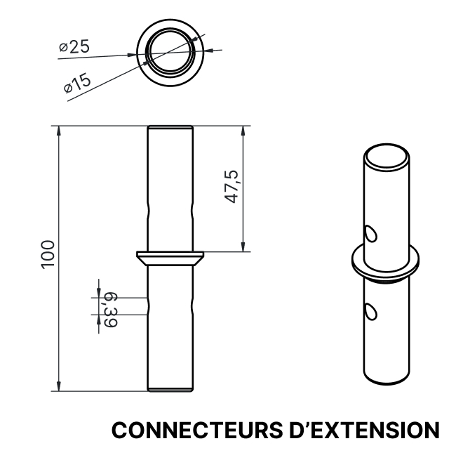

 # TP02 Exposition des étudiants finissants en TIM
 
 Photo prise par Olivier Leconte

 ## Photo de moi devant l'exposition
 #
Bonjour, je vais vous parlez de l'exposition Résonnance. Il s'agit de plusieurs oeuvres finissants en Tim. Ils y avaient beaucoup d'oeuvres intéressantes avec des idées extraodinaires. En espérant que cela va vous plaires, mais avant, voici un 
ordre de 1 à 10 selon mes projets préférés.

# Ordre de préférence des projets.
# Prismatica

## Équipe

    Ikrame Rata : Chef de projet.
    Vincent Delisle : Développeur et concepteur sonore. 
    Jérémy Duverseau : Directeur artistique.

## Photo à l'appuie
Bon pour commencer, l'oeuvre ce base sur la chromesthésie une forme de synesthésie permettant avec des équipements d'entendre les couleurs dessinées sur un tableau.
Les matériaux utilisées sont : 
un tableau permettant de dessiner dessus.

Photo prise par Olivier Leconte.
#
Un écran qui permet de voir ce qu'on dessine. 

Photo prise par Olivier Leconte.
#
Ainsi que des hauts parleurs pour entendre la couleur des sons.

  Photo prise par Olivier Leconte.
#
Voici une plantation qui résume comment ils voulaient faire pour mettre leur oeuvre dans un local. je trouve cela très intéressant parce que ça montre qu'ils sont impliqués et un capable de précision très professionnel.

Resource trouvée et partagée par Prismatica sur leur site :  https://pootpookies.github.io/Prismatica/#/30_production/60_plantation/ 

 ## Mon ressenti
 
  ### Positif
  Je trouve que l'idée d'entendre les couleurs est d'une créativité incroyable. À part ça, je n'ai pas d'autres opinions.
  ### Négatif
  Malheuresement, l'execution de l'idée est un mal fait. Je trouve qu'il manque d'explication. Lors de ma visite, je n'ai pas trouvé l'équipe vraiment intéressant. Parfois, il manquait des explications. Aussi, le son était pas en synchro avec ce qu'on dessinait.

## Luminatura

  Photo prise par Olivier Leconte.

## Équipe 

    Prethiah Rajaratnam : Programmeuse et administratrice du projet.
    Audrey Dandurand : Directrice Audio Visuel et Gestionnaire de projet.
    Justine Rousseau : Programmeuse Coordinatrice des medias.
    Camilia Bouatmani : Directrice Artistique. 
    Ihab Mouhajer : Développeur intéractif.

## Photo à l'appuie
Il y a deux projecteur, mais j'ai réussi à prendre en photo malheureusement parce que je savais pas où se trouvait le deuxième projecteur.

Photo prise par Olivier Leconte.
#
Ensuite, il y'a des plaques métalliques qui permettent de detecter la main et cela cause plusiseurs couleurs à afficher. Aussi des hauts parleurs qui permettent de faire du son lorsqu'on touche la plaque.

Photo prise par Olivier Leconte.
#
Pour finir, voici à quoi l'oeuvre ressemble au finale.

Photo prise par Olivier Leconte.

## Plantation
 Voici la structure de base.
 
 Resource trouvée et partagée par Luminatura sur leur site : https://miaou-mafia.github.io/projet-luminatura/#/30_production/60_plantation/
 #
 Voici la structure du studio
 
 Resource trouvée et partagée par Luminatura sur leur site : https://miaou-mafia.github.io/projet-luminatura/#/30_production/60_plantation/

  ## Mon ressenti
  
   ### Positif
  Je trouve que l'oeuvre visuellement est magnifique. Les fleurs sont posés sur le mur et qui interagisaient avec le projecteur. L'idée lorsqu'on touche les plaques métalliques et qu'ils permettent t'interagir avec l'oeuvre est incroyable. D'un tel spectacle.  
  ### Négatif
  Le seul défaut que j'ai pu trouver est le manque de variation de couleurs. À part ça, je trouvais l'oeuvre intéressant.
  
## Arcadia
 
 Photo prise par Olivier Leconte.
 
## Équipe

    Dominic Yale : Conception sonore.
    William Beauvais : Conception visuelle.
    Anton Nikulin : Programmation.
    
## Photo à l'appuie
Il manque beaucoup de photo, donc j'ai seulement pris çeux là. Les photos que je vais vous montrez sont seulement lorsque le projet était même pas finit.
Voici une photo en action à quoi ressemble Arcadia.

Photo prise par Olivier Leconte.
#
Ensuite, une autre où on trouve la manette qui permet de jouer au jeu.

Photo prise par Olivier Leconte.

## Plantation
Voici à quoi ressemble de l'oeuvre.
 
 Resource trouvée et partagée par Arcadia sur leur site : https://cousi-cousa.github.io/Arcadia/#/30_production/60_plantation/

  ## Mon ressenti
  
  ### Positif
  Une borne d'arcade est toujours la meilleure idée quand il s'agit de faire un jeu vidéo classique très efficace. Rien à rajouter.
  ### Négatif
  Beaucoup de chose à dire. Premièrement, on ne connait pas complétement comment ils ont fait pour mettre les cables, ils y a quoi dedans,etc.
  Deuxièmement, le manque d'explication du projet est aussi est problématique. Ce genre de truc est le truc le plus important. 
 
 ## C0N DU8

Resource trouvée et partagée par C0N DU8 sur leur site : https://gearshift-games.github.io/Web-C0N-DU8/#/

 ## Équipe
 
    Ian Corbin : Designer de niveaux
    Samuel Desmeules-Voyer : Directeur artistique.
    Alexandre Gervais : Programmeur des méchansimes.
    Keven Malric : Responsable du développement technique.
    Jérémy Roy-Coté : Programmeur Interconnectivité.

  ## Photo à l'appuie

  Voici une photo qui montre Keven Malric en action. 
  
  Photo prise par Olivier Leconte.
#
  Une photo d'une course de moto.
  
    Photo prise par Olivier Leconte.

 ## Plantation 

 Voici une photo de la structure.
  
Resource trouvée et partagée par C0N DU8 sur leur site : https://gearshift-games.github.io/Web-C0N-DU8/#/

   ## Mon ressenti
   
  ### Positif
  Je trouve que l'idée de faire du biclette est incroyable. Non seulement ça encourage les jeunes et adultes à jouer, mais ça rassemble les personnes qui aiment jouer aux jeux-vidéos et le sport.
  ### Négatif
  Le seul problème est que quand j'étais venu, le jeu n'était pas finit. Le personnage restait droit sans tourner ni à gauche ni à droite. Je suis pas repasser pour voir le projet finale.
  
     
 ## ETHERIA

Resource trouvée et partagée par Etheria sur leur site : https://ethereal-creators.github.io/Etheria/#/

## Équipe
    Joshua Gonzalez-Barrera : Monteur Vidéo, Artiste Design, Programmeur.
    Victor Gileau : Programmeur, Artiste Design.
    Michael Un Dupré : Programmeur, Artiste VFX/Design.
    Pierre-Luc Proulx : Progammeur, Artiste VFX/Design, Artiste 3D.
    Maik_Hamel : Compositeur Sonore, programmeur.

 ## Photo à l'appuie
 
 Voici une photo d'un projecteur qui permet d'afficher l'oeuvre.
 
  Photo prise par Olivier Leconte.
#
 l'image montre une kinect qui permet aux utilisateurs de bouger et de frapper les ennemis.
 
 Photo prise par Olivier Leconte.

  ## Plantation 
 
  Voici une ancienne photo de la structure.

Resource trouvée et partagée par Etheria sur leur site : https://ethereal-creators.github.io/Etheria/#/30_production/60_plantation/
#
Voici la nouvelle structure.

Resource trouvée et partagée par Etheria sur leur site : https://ethereal-creators.github.io/Etheria/#/30_production/60_plantation/

 
## Mon ressenti

### Positif
   Malheureusement, Je n'ai pas testé l'oeuvre.
  ### Négatif
   Malheureusement, Je n'ai pas testé l'oeuvre.
  
## FUGA

## Équipe
    Yavuz-Selim Gucluer : Progammeur.
    Daniel Dezemma : Directeur Visuel.
    Tristan Khadka : Directeur sonore.
    Abdel Ali Djeral : Programmeur.

   ## Photo à l'appuie

   Voici une photo de l'arbre. 

 Photo prise par Olivier Leconte.
 #
 Une autre photo qui montre l'haut parleur.

#
Pour finir, Une photo qui montre les prises qui connecte les synthétiseurs et les écrans.

 Photo prise par Olivier Leconte.

 

 ## Plantation

 Pour commencer, on s'imagine comment on met les lianes en plastique sur l'haut parleur. 
  
 Resource trouvée et partagée par FUGA sur leur site : https://escapism-fuga.github.io/Fuga/#/30_production/60_plantation/
 #
  Ensuite, la photo montre comment on visualise les lianes en plastique sur l'écran et le support depuis le plafond.
  
  Resource trouvée et partagée par FUGA sur leur site : https://escapism-fuga.github.io/Fuga/#/30_production/60_plantation/
  #
  Pour finir, une vue d'en haut pour voir si sa marche.
  
   Resource trouvée et partagée par FUGA sur leur site : https://escapism-fuga.github.io/Fuga/#/30_production/60_plantation/

   ## Mon ressenti
 
  ### Positif
  L'idée de faire un arbre est géniale avec des écrans,mais Rien de plus. 
  ### Négatif
  Personnellement, J'ai trouvé le projet fade. Le manque de communication, le manque d'action, le manque d'explication du projet, etc. Bref, le projet aurait pu etre géniale, mais le manque de tous les choses nommées précèdement tue un peu le projet.
  Aussi, on ne comprend pas réellement le but du projet. Sa aurait été geniale de dire par exemple que les écrans pollues les arbres en expliquant pourquoi les écrans sont collés sur l'arbre.  

## Internarture 

Photo prise par Olivier Leconte.

## Équipe

    Sitmonternna Yi : Responsable de la gestion et suppervision des ressources techniques, mapping vidéo, conception sonore.
    Delphine Grenier : Gestion et l'organisation du projet, Programmation de l'interactivité, visuelle.
    Isaac Fafard : Intégrateur multimédia. Responsable de la communication entre le numérique et le réel. Programmeur.
    Kenza El Harrif : Direction artistique, conception sonore.
    Khaly Tia Sing : Chargée de l'équipe, l'organisation du projet, qualité des projets, programmation des lumières

   ## Photo à l'appuie
   
   Voici une photo de la boule qui permet de faire monter les fleurs
   
   Photo prise par Olivier Leconte.
   #
   La photo des fleurs
 
   Photo prise par Olivier Leconte.
   #
   Voici une photo de l'ensemble de l'oeuvre
   
   Photo prise par Olivier Leconte.

   ## Mon ressenti
   
  ### Positif
  Parler de la nature est toujours un sujet que j'aime beaucoup. J'aime tellement l'idée de mettre une boule au milieu et de voir les fleurs monter graduellement est tellement beau. Quand j'y étais allé il y avait Kenza El Harrif, une femme brillante qui a réussi à conquérir mon coeur juste en trouvant les bons mots.
  ### Négatif
  J'aurais juste aimé voir plusieurs animations de fleurs. 

   ## Plantation 
Voici la structure vue en 3d

#
Le connecteur.

#
La sphère.

#
Pour finir la vue de haut

## Pour finir

Je ne savait pas que la kinect pouvait être utilisé comme un detecteur de mouvement autre sur la console xbox. Cela ma vraiment surpris de le voir dans l'oeuvre ETHERIA.

    
   
   
