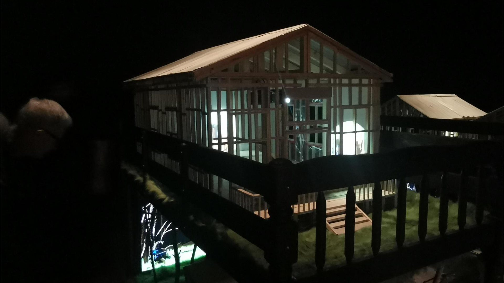
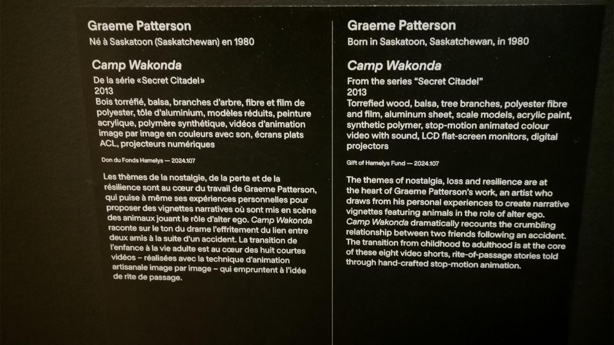
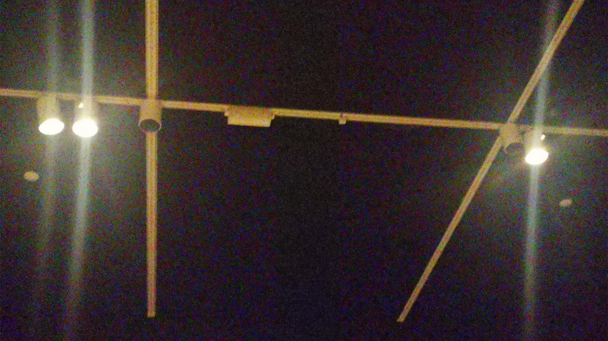
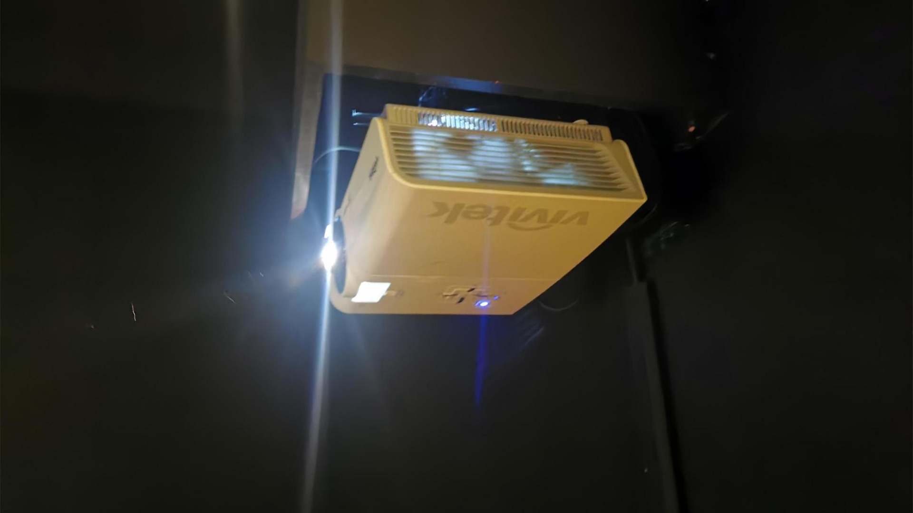

#  Exposition :  Graeme Patterson Camp Wakonda

 Photo prise par Olivier Leconte

 ## Début 
 Bonjour, aujourd'hui je vais vous parler d'une exposition que j'ai eu la chance de participer. Il s'agit de Camp Wakonda. je suis y aller le 3 Avril 2025.
 L'oeuvre à été Créé en 2013, Camp Wakonda fait partie d’une série appelée Secret Citadel. Une série qui a pour but d’exprimer la perte, la nostalgie et la résilience.
 Dans l’œuvre Camp Wakonda, nous suivons deux amis qui ont fait un accident et depuis, nous les voyant grandir en 8 sections de vidéos.
 
 Photo prise par Olivier Leconte

## Type d'exposition
 Il s’agit d’une exposition intérieure et temporaire. On pouvait seulement regarder de près et on ne pouvait pas toucher l’œuvre. 

 ## Éléments nécessaires à la mise en exposition

 Dans l’exposition, la salle était sombre permettant à l’œuvre d’être au centre de l’attention. Au-dessus de l’œuvre, il y avait 3 projecteurs de lumières permettant d’éclairer l’œuvre
 et un projecteur de vidéo qui affichait le feu sur l’accident. Dans chaque coin de l’œuvre, Il avait 8 mini projecteurs qui affichaient des mini vidéos. Je pense à un moment,
 il avait un haut-parleur qui jouait du son. À l’entrée, à gauche il y avait le cartel qui expliquait comment et pourquoi le projet existe aujourd’hui.

 ## Composants

 Maintenant, allons plus en profondeur concernant les composants. Dans les images que vous vous apprêtez à voir, vous pourriez voir les éléments qui permettent de faire fonctionner l'exposition.

 ### Les projecteurs de lumière
 Attaché depuis le plafond,ces projecteurs permettaient d'illuminer l'oeuvre puisque la salle était sombre.
 
 Photo prise par Olivier Leconte
 

 ### Le projecteur de vidéo
  Acrrocher sur un mur,ce projecteur permettait seulement de lancer une vidéo et grâce à cette vidéo des flammes donnaient l'impression de bouger.
  
   Photo prise par Olivier Leconte

 ### Mini projecteurs
  Il s'agit de huit projecteurs affichant des mini vidéos permettant de comprendre l'oeuvre.

  ### haut-parleurs
  Il y avait des haut-parleurs accroché dans l'oeuvre juste à coté des mini projecteurs pour jouer du son.

  ### Des modèles réduits
  Toute l'oeuvre était reposée sur ça. C'était la force du projet. Tout ce qu'on voyait était réduit les arbres, les véhicules, l'herbe, les personages et la maison. 
  honnêtement, je trouve vraiment ces modèles réduits incroyable. On ressent vraiment que tout l'aspect était ça

  ## Expérience Vécue
  Pour commencer, les choses qui m’ont plu sont les modèles réduits. Je trouve que les personnages ainsi que les objets sont très bien faits. On ressent cette sensation de gêne, et cette gêne est incroyable.
  Aussi, l’atmosphère était réussie : on ressent vraiment l’aspect étrange et la nostalgie. En revanche, je trouvais qu’il était très facile de se perdre. Je n’avais pas très bien compris l’œuvre,
  et cela m’avais pris plusieurs minutes pour la comprendre.Aussi, l'oeuvre on ne pouvait pas trop  intéragir avec et je trouve cela vraiment dommage. Bref, je note l'exposition de Graeme Patterson Camp Wakonda une note de 6/10.

  
  

 
